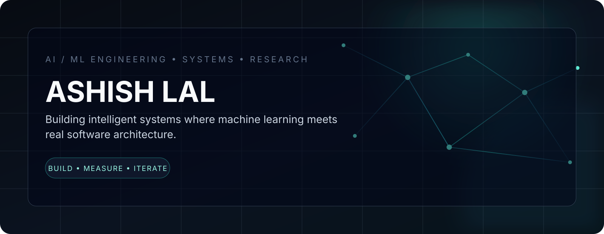

# ASHISH LAL

**AI / ML Engineer · AI Systems · Backend · Research**

I build intelligent systems at the boundary of **machine learning, software architecture, and autonomous decision-making**.

[GitHub](https://github.com/Weirdgamer20) · [LinkedIn](https://www.linkedin.com/in/ashishlal20)

---

## Selected Work

<table>
<tr>
<td width="50%" valign="top">

### TradeHive

**Reinforcement-learning trading infrastructure**

A systems-oriented trading platform separating learned strategy from deterministic risk, execution, and reconciliation.

`Rust` `RL` `Risk Systems`

[Repository →](https://github.com/Weirdgamer20/tradehive)

</td>
<td width="50%" valign="top">

### EcoConnect

**AI civic issue intelligence**

A full-stack platform for collecting civic reports, applying AI triage, clustering related issues, and routing them toward accountable resolution.

`Next.js` `TypeScript` `PostgreSQL` `Redis`

[Repository →](https://github.com/Weirdgamer20/Eco-connect)

</td>
</tr>
<tr>
<td width="50%" valign="top">

### RLLS16

**Reinforcement-learning simulation**

An experimental environment for studying agents, world dynamics, spatial behavior, and measurable simulation outcomes.

`Python` `PyTorch` `RL` `Simulation`

[Repository →](https://github.com/Weirdgamer20/RLLS16)

</td>
<td width="50%" valign="top">

### Mine-Bot

**Autonomous learning agent for Minecraft**

An attempt to move from scripted gameplay toward perception, memory, planning, action, and environment feedback.

`Python` `RL` `World Models` `Planning`

[Repository →](https://github.com/Weirdgamer20/Mine-Bot)

</td>
</tr>
</table>

### Farm Advisor

**Applied machine learning for agricultural intelligence**

Crop recommendation, soil intelligence, weather context, and disease-oriented computer vision in one applied ML system.

`FastAPI` `React` `Scikit-learn` `TensorFlow`

[Repository →](https://github.com/Weirdgamer20/farm-advisor-1)

---

## Research Direction

### Quantum VRP / AQTRO

Researching optimization methods for vehicle-routing problems with an eventual focus on **quantum approaches and meta-learning**.

`Optimization` `Quantum Computing` `Meta-Learning`

[Research repository →](https://github.com/Weirdgamer20/SIH2026-Quantum-VRP)

---

## Engineering Stack

| Domain | Technologies |
|---|---|
| **AI / ML** | PyTorch · TensorFlow · Scikit-learn · Reinforcement Learning · World Models |
| **Backend** | FastAPI · Node.js · REST · PostgreSQL · Redis |
| **Systems** | Agents · Simulation · Optimization · Evaluation |
| **Infrastructure** | Docker · AWS · Railway · GitHub Actions |
| **Languages** | Python · TypeScript · JavaScript · Rust · SQL |

> **Build systems, not demos.**

I value explicit interfaces, deterministic boundaries around learned components, reproducibility, measurable behavior, and failure-aware design.

---

**AI / ML · AI Engineering · Backend · Research**

[Connect on LinkedIn →](https://www.linkedin.com/in/ashishlal20)

