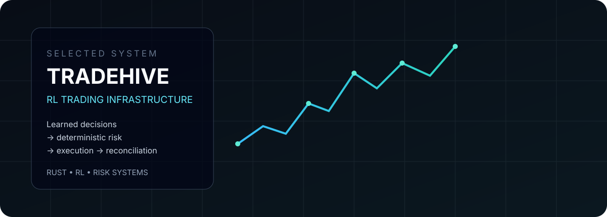
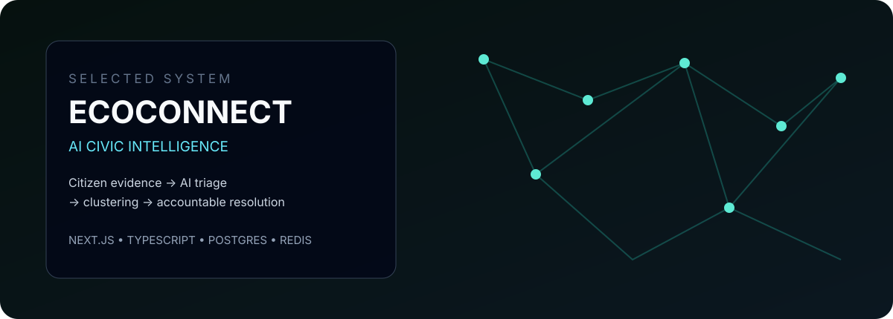
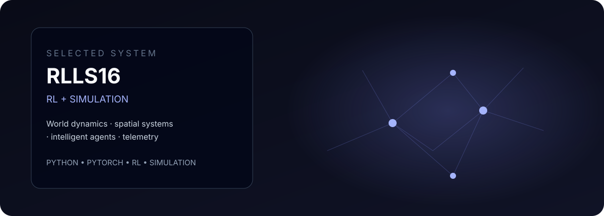
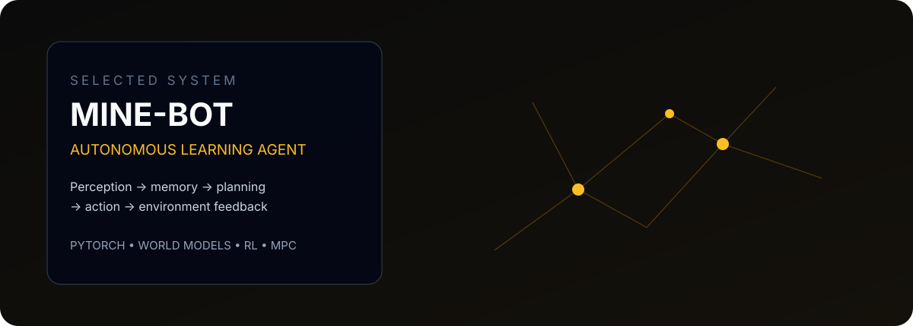
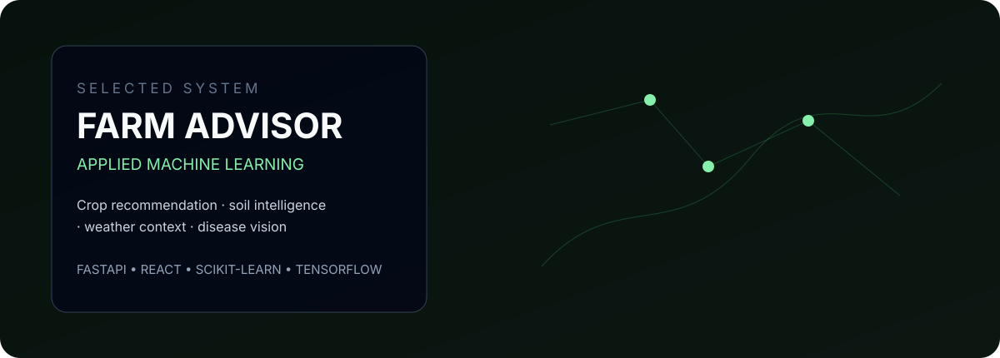

**AI / ML Engineer · AI Systems · Backend · Research**

Building intelligent systems where machine learning meets real software architecture.

<a href="https://github.com/Weirdgamer20">GitHub</a> · <a href="https://www.linkedin.com/in/ashishlal20">LinkedIn</a>

---

## Selected Systems

<table>
<tr>
<td width="50%" valign="top">

**TradeHive**  
Rust · Reinforcement Learning · Risk Systems

</td>
<td width="50%" valign="top">

**EcoConnect**  
Next.js · TypeScript · PostgreSQL · Redis · Gemini

</td>
</tr>
<tr>
<td width="50%" valign="top">

**RLLS16**  
Python · PyTorch · Reinforcement Learning · Simulation

</td>
<td width="50%" valign="top">

**Mine-Bot**  
World Models · RL · Curiosity · Planning

</td>
</tr>
</table>

### Farm Advisor

Python · FastAPI · React · Scikit-learn · TensorFlow

---

## Research

**Quantum VRP / AQTRO**  
Vehicle-routing optimization research exploring quantum approaches and future meta-learning methods.

`Optimization` `Quantum Computing` `Meta-Learning`

<a href="https://github.com/Weirdgamer20/SIH2026-Quantum-VRP">Research repository →</a>

---

## Engineering Focus

| Area | Focus |
|---|---|
| **AI / ML** | PyTorch · TensorFlow · Scikit-learn · Reinforcement Learning · World Models |
| **Systems** | Intelligent Agents · Simulation · Optimization · Evaluation |
| **Backend** | FastAPI · Node.js · REST · PostgreSQL · Redis |
| **Infrastructure** | Docker · Linux · AWS · Railway · GitHub Actions |
| **Languages** | Python · TypeScript · JavaScript · Rust · SQL |

> **Build systems, not demos.**

I care about explicit interfaces, deterministic boundaries around learned components, reproducibility, measurable behavior, and failure-aware system design.

---

### AI/ML · AI Engineering · Backend · Research

<a href="https://www.linkedin.com/in/ashishlal20">Connect on LinkedIn →</a>

